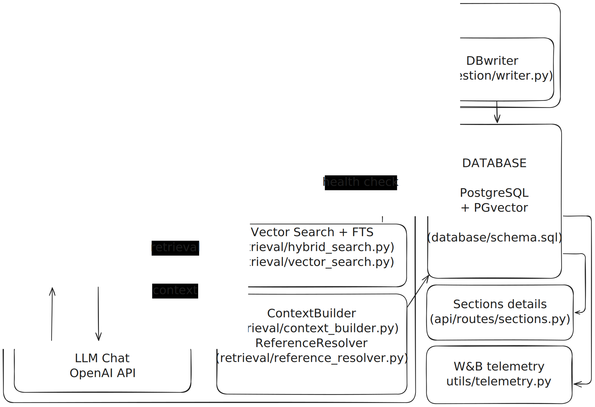
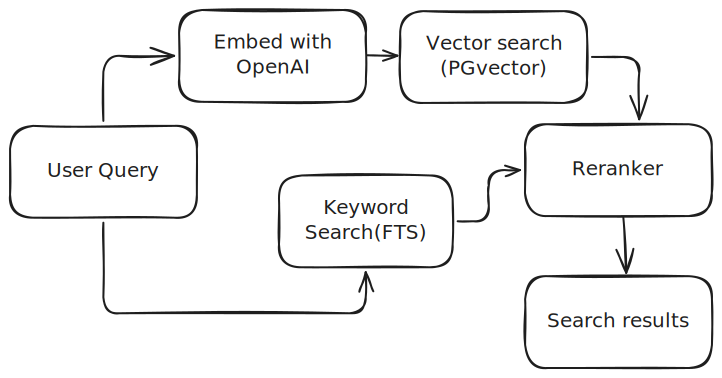
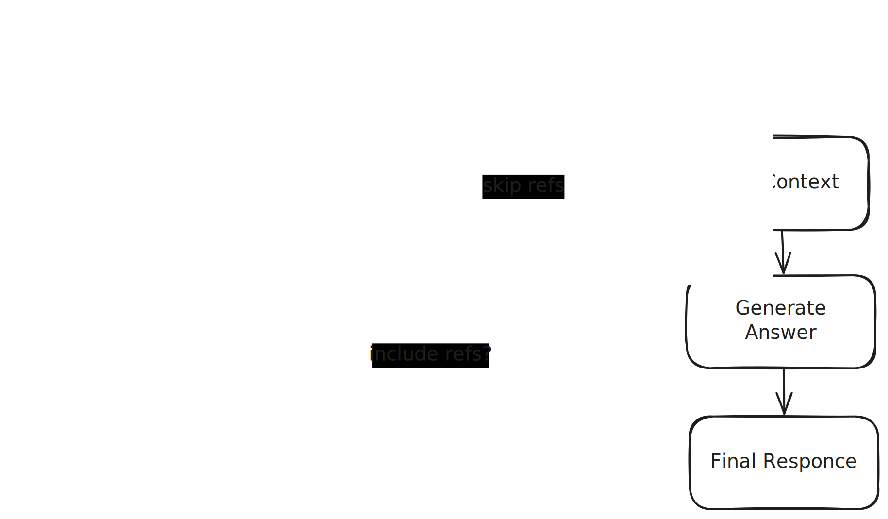

# Building Code RAG Platform

An end-to-end toolkit for turning the 2021 International Building Code into a searchable Retrieval-Augmented Generation (RAG) assistant.

---

## System Overview

This repository implements the **Document Intelligence & Compliance System** and the **Conversational AI Interface & Knowledge Assistant** for a construction-focused AI platform.

- Parses the 2021 International Building Code (IBC) into structured JSON (chapters, sections, tables, figures).
- Stores the normalized content in a **Postgres + pgvector** database.
- Exposes a **RAG (Retrieval-Augmented Generation) API** via FastAPI.
- Integrates with **LibreChat** to provide a chat-based assistant that can answer code/compliance questions with **grounded, cited answers**.

This module acts as the **building code knowledge backbone** that other components (e.g., drawing/blueprint analysis, risk assessment engine) can query for regulatory constraints and explanations.

---

## Table of Contents
- [Quick Start](#quick-start)
  - [Environment Configuration](#environment-configuration)
  - [Docker Compose](#docker-compose)
  - [Parse the PDF](#parse-the-pdf)
  - [Embed & Ingest](#embed--ingest)
- [Architecture Overview](#architecture-overview)
  - [System Architecture Diagram](#system-architecture-diagram)
  - [Parsing Pipeline](#parsing-pipeline)
  - [Search Mechanics](#search-mechanics)
  - [Context & References](#context--references)
  - [RAG API](#rag-api)
  - [Static Document Hosting & Citation Links](#static-document-hosting--citation-links)
  - [Chat UI (LibreChat)](#chat-ui-librechat)
    - [LibreChat Integration](#librechat-integration)
- [LangGraph Workflow Overview](#langgraph-workflow-overview)

---

## Quick Start

### Environment Configuration

1. Copy the sample file and edit to match your environment:

   ```bash
   cp .env.example .env
   ```

2. Important variables:

   `OPENAI_API_KEY` Required for embeddings + LLM answers
   `Weights & Biases setup` Required for [`wandb.ai`](https://wandb.ai/site/)

3. If you cloned without the LibreChat submodule:

   ```bash
   git submodule update --init --recursive
   ```

---

### Docker Compose

The Compose file launches:

| Service | Description | Ports |
|---------|-------------|-------|
| `postgres` | Postgres 16 + pgvector, auto-seeded with schema | `${POSTGRES_PORT:-55432}` |
| `rag-api` | FastAPI app exposing REST + OpenAI-compatible endpoints | `${API_PORT:-8000}` |
| `librechat-mongo` | MongoDB backing store for LibreChat | internal |
| `librechat` | LibreChat UI/API talking to `rag-api` | `${LIBRECHAT_PORT:-3080}` |

Bring everything up:

```bash
docker compose up --build   # foreground
```

Health checks ensure `postgres` is ready before the API starts, and LibreChat waits for both the API and Mongo.

When the stack is running:

- API docs & health: http://localhost:8000/docs and `/health`
- LibreChat UI: http://localhost:3080
- Static PDF (for citations): http://localhost:8000/static/2021_International_Building_Code.pdf

---

### Parse the PDF

   ```bash
   uv run python parser/src/scripts/run_parser.py
   ```

   Outputs land in `parser/output/`:

   - `parsed_document.json` – canonical data set for ingestion
   - `images/`, `tables/` – extracted assets
   - `table_regions.json` – table detection metadata

### Embed & Ingest

   ```bash
   uv run python parser/src/scripts/run_embeddings.py
   ```

   This writes sections, tables, figures, and embeddings to Postgres.

---

## Architecture Overview

### System Architecture Diagram



### Parsing Pipeline

   - Extracts text, tables, and figures from the IBC PDF.  
   - Normalizes content into chapters, sections, table metadata, and image references.  
   - Outputs a single `parsed_document.json` artifact.

### Search Mechanics



1. **Embedding** (`rag/ingestion/embedder.OpenAIEmbedder`): cached singleton produces query vectors. Deterministic hashing fallback is available when no API key is configured (dev/testing).
2. **Vector Search** (`rag/retrieval/vector_search.py`): converts the query embedding to `pgvector.Vector` and runs `ORDER BY s.embedding <=> %s` to score sections by cosine distance.
3. **Keyword Search** (`rag/retrieval/hybrid_search.py`): uses PostgreSQL full-text search (`plainto_tsquery`) over the `sections.full_text_search` column, ordering by `ts_rank`.
4. **Reciprocal Rank Fusion** (`rag/utils/ranking.py`): merges vector and keyword result IDs so documents appearing in both lists get boosted. This is the default `hybrid` mode exposed via `options.search_type="hybrid"`.
5. **Vector-only Mode**: bypasses keyword search/fusion entirely; useful for purely semantic queries or benchmarks.

The `/search` FastAPI endpoint (`rag/api/routes/search.py`) exposes both strategies, while the LangGraph workflow consumes the same searchers internally.

### Context & References

- **ContextBuilder** (`rag/retrieval/context_builder.py`): follows parent/child pointers in the `sections` table to supply broader and more detailed text around each retrieved hit. Options currently default to include both.
- **ReferenceResolver** (`rag/retrieval/reference_resolver.py`): looks up related tables, figures, and cross-referenced sections via `section_references`. Results are threaded through the workflow so the response payload can cite them explicitly.

Both helpers use shared database connections via `rag/database/connection.get_sync_connection`, ensuring pgvector support and pooling.

### RAG API

| Endpoint | Method | Description |
|----------|--------|-------------|
| `/health` | GET | Health probe used by Compose and debugging |
| `/query` | POST | Runs the LangGraph workflow (retrieval + answering) |
| `/search` | GET | Hybrid keyword/vector search over ingested sections |
| `/sections/{section_number}` | GET | Fetch metadata for a specific section |
| `/v1/chat/completions` | POST | OpenAI-compatible endpoint used by LibreChat |
| `/v1/models` | GET | Lists the custom `building-code-rag` model |

Responses produced by `/query` and `/v1/chat/completions` include Markdown-formatted answers plus a References section.

### Static Document Hosting & Citation Links

- `static/2021_International_Building_Code.pdf` is copied into the Docker image and mounted by FastAPI at `/static`.
- `REFERENCE_URL_TEMPLATE` (e.g. `http://localhost:8000/static/2021_International_Building_Code.pdf#page={page}`) so the backend can embed proper hyperlinks in its Markdown output.
- The same value is stored on each section/table/figure record as `url`, making it trivial for other clients to provide rich previews.
- If you need to serve additional files, drop them under `static/`

### Chat UI (LibreChat)

   - Front-end UI for users.  
   - Sends OpenAI-compatible chat requests to the local RAG API.
   - Allow reinforcement learning.  
   - Displays model responses with citations back into the building code.

   #### LibreChat Integration

- `librechat.config.yaml` disables most modules (prompts, presets, search, agents) for a focused chat experience.
- The `BuildingCodeRAG` endpoint is defined as a **custom provider** with:
  - `baseURL`: `http://rag-api:8000/v1`
  - `model`: `building-code-rag`
  - `titleConvo: true` to auto-title conversations
  - `summarize: false`
  - `dropParams` removing unsupported OpenAI parameters
- Update `librechat.config.yaml` to expose additional models or features if needed.
- When auth is enabled, LibreChat sends `Authorization: Bearer <LIBRECHAT_RAG_API_KEY>` and the FastAPI app verifies it against `RAG_API_KEY`.


---

## LangGraph Workflow Overview



- **Analyze Query** (`rag/graph/nodes.py`): categorizes the prompt (factual/procedure/comparison) and locks in the requested strategy (`hybrid` by default or `vector` via `options.search_type`).
- **Retrieve Sections**: calls either the hybrid or pure vector and stores the hits plus metadata (e.g., retrieval count, strategy).
- **Resolve References**: fetches tables, figures, and section references referenced by the retrieved hits.
- **Build Context**: enriches each hit with parents and children to preserve the hierarchical structure of the building code.
- **Generate Answer**: constructs a consolidated context string and calls OpenAI Chat; falls back to an extractive summary if an API key/model is unavailable.
- **Format Response**: packages the answer, citations, sections, parents/children, and resolved references into the JSON schema returned by FastAPI (and by the OpenAI-compatible adapters).

`rag/graph/workflow.py` wires these nodes with LangGraph’s `StateGraph`, setting `QueryState` as the shared mutable map that moves through the pipeline. The workflow is compiled once and reused by API routes and scripts.
